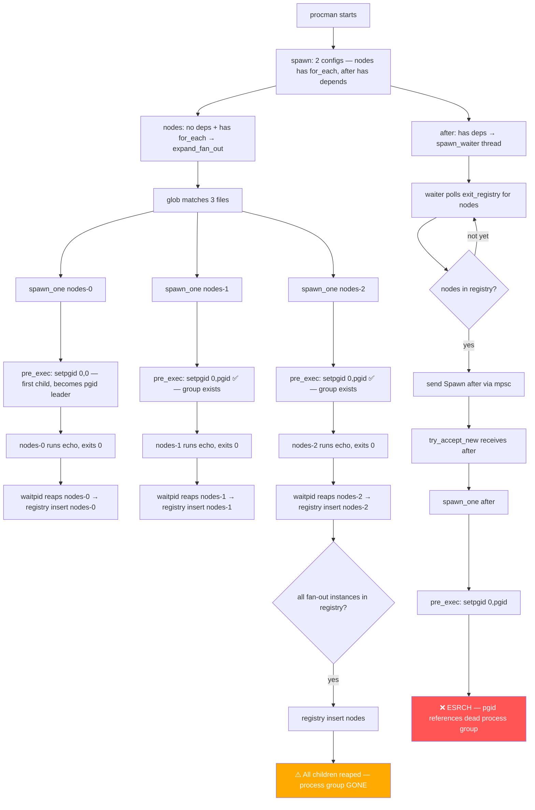

```mermaid
flowchart TD
    A[procman starts] --> B["spawn: 2 configs — nodes has for_each, after has depends"]

    B --> C["nodes: no deps + has for_each → expand_fan_out"]
    B --> D["after: has deps → spawn_waiter thread"]

    C --> E[glob matches 3 files]
    E --> F["spawn_one nodes-0"]
    E --> G["spawn_one nodes-1"]
    E --> H["spawn_one nodes-2"]

    F --> I["pre_exec: setpgid 0,0 — first child, becomes pgid leader"]
    G --> J["pre_exec: setpgid 0,pgid ✅ — group exists"]
    H --> K["pre_exec: setpgid 0,pgid ✅ — group exists"]

    I --> L[nodes-0 runs echo, exits 0]
    J --> M[nodes-1 runs echo, exits 0]
    K --> N[nodes-2 runs echo, exits 0]

    L --> O["waitpid reaps nodes-0 → registry insert nodes-0"]
    M --> P["waitpid reaps nodes-1 → registry insert nodes-1"]
    N --> Q["waitpid reaps nodes-2 → registry insert nodes-2"]

    Q --> R{"all fan-out instances in registry?"}
    R -->|yes| S["registry insert nodes"]

    S --> T["⚠️ All children reaped — process group GONE"]

    D --> U["waiter polls exit_registry for nodes"]
    U --> V{"nodes in registry?"}
    V -->|not yet| U
    V -->|yes| W["send Spawn after via mpsc"]

    W --> X["try_accept_new receives after"]
    X --> Y["spawn_one after"]
    Y --> Z["pre_exec: setpgid 0,pgid"]
    Z --> FAIL["❌ ESRCH — pgid references dead process group"]

    style FAIL fill:#f55,color:#fff
    style T fill:#fa0,color:#fff
```
